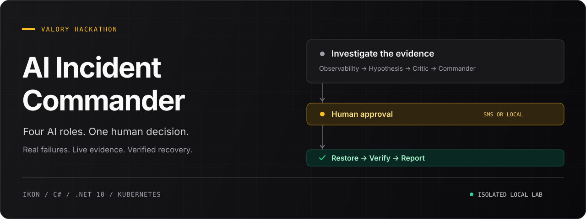
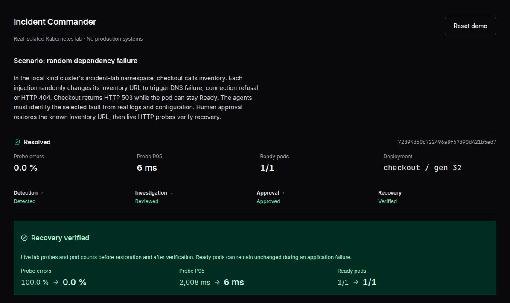
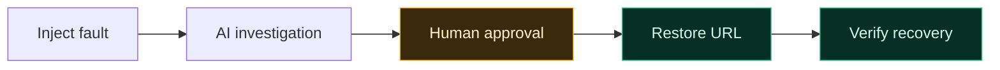

<p align="center">
  
</p>

<p align="center">
  <strong>Investigate a real incident. Challenge the diagnosis. Approve the recovery.</strong><br />
  A hackathon demo built with Ikon, C# and a real local Kubernetes lab.
</p>

<p align="center">
  <a href="#the-demo">The demo</a> ·
  <a href="#how-it-works">How it works</a> ·
  <a href="#run-it-locally">Run locally</a> ·
  <a href="docs/development.md">Development guide</a>
</p>

## The demo

Checkout is returning **HTTP 503**, but its pod is still **Ready**. Four AI roles examine live Kubernetes evidence, challenge the diagnosis and propose a specific repair. A human approves it. The app restores the inventory URL and checks that checkout actually works again.



<p align="center"><sub>Actual dashboard after recovery. Readings are from one local demo run, not a performance benchmark.</sub></p>

[Follow the captured incident from investigation to approval and recovery →](docs/demo.md)

| What you see | What happens underneath |
| --- | --- |
| A real dependency failure | A randomly selected inventory URL change causes a DNS failure, connection failure or HTTP 404. |
| Four distinct AI roles | Observability, Hypothesis, Critic and Commander work through the evidence in sequence. |
| A human decision | Approve by [SMS](docs/demo.md#sms-on-the-phone) or use the explicitly labelled local lab fallback. Approval is bound to the incident and deployment. |
| Verified recovery | The app restores the known inventory URL, probes checkout and produces a downloadable Markdown report. |

All workload changes stay inside the local `incident-lab` namespace. No production systems are connected.

## How it works



| Role | Responsibility |
| --- | --- |
| **Observability** | Read live configuration, logs, dependency health and probe results. |
| **Hypothesis** | Rank possible explanations against the observations. |
| **Critic** | Challenge the leading explanation and identify missing evidence. |
| **Commander** | Request another investigation round, propose the permitted repair or escalate. |

The Commander proposes recovery; application code enforces approval. Codes are single-use, expire after five minutes and bind to the current incident and deployment identity. A changed deployment invalidates the repair. Investigation is limited to three rounds, with timeouts on model calls. Inconclusive investigations or failed recovery escalate to an operator; denied or expired approval leaves the service degraded.

### Walk through an incident

1. **Inject a fault.** The app randomly selects one of the three dependency failures. The selected fault must be discovered from evidence.
2. **Follow the investigation.** Read the specialist assessments and the Commander's rationale.
3. **Approve or deny.** Reply to the SMS exactly as instructed, or enter the pending code in the local lab approval control. With SMS configured, the injection action can send a real approval request.
4. **Inspect the outcome.** Review the live recovery checks and copy or download the report. **Reset demo** restores the lab and invalidates outstanding approvals.

## Run it locally

You need **Ikon CLI with an authenticated package feed**, **.NET 10**, **Node.js 24**, and **Docker, kind, kubectl and curl**. Local verification also uses **Bash, GNU coreutils, Python 3 and ShellCheck**.

> **Lab setup comes first.** The current demo targets the `kind-incident-lab` context and uses the devbox-specific kubeconfig path `/home/dev/.config/incident-commander/lab.kubeconfig` in both the shell script and C# adapter. Follow the [Kubernetes lab guide](lab/README.md) to create and seed the lab before starting the app.

```sh
git clone https://github.com/G-man3207/Valory-Hackathon.git
cd Valory-Hackathon

# After installing the Ikon CLI:
ikon login
npm ci --prefix IncidentCommander/frontend-node
dotnet tool restore

# Create the cluster as described in lab/README.md, then:
./lab/lab.sh seed
./verify.sh

(cd IncidentCommander && ikon app run --no-auto-frontend-login)
```

The local approval path works without SMS credentials. For SMS, the development launcher, private Tailscale access and explicit live-cluster checks, see the [development guide](docs/development.md).

## Inside the repo

| Path | Purpose |
| --- | --- |
| [`IncidentCommander/app/IncidentCommander/`](IncidentCommander/app/IncidentCommander/) | C# orchestration, approval rules, Kubernetes adapter and native Ikon UI. |
| [`IncidentCommander/frontend-node/`](IncidentCommander/frontend-node/) | React, TypeScript and Vite frontend hosting the Ikon UI. |
| [`IncidentCommander/checks/`](IncidentCommander/checks/) | Executable domain, SMS and Kubernetes guard checks. |
| [`lab/`](lab/) | Python checkout and inventory services, kind config and lab commands. |
| [`verify.sh`](verify.sh) | Local lint, type, build, formatting and guard checks. |
| [`docs/demo.md`](docs/demo.md) | A real incident captured in four stages. |
| [`docs/development.md`](docs/development.md) | Setup details, SMS configuration and development operations. |

## Scope

This is a hackathon prototype with one checkout-to-inventory scenario and three possible faults. Recovery is restricted to restoring the known inventory URL. One incident runs per session; workflow state is in memory, while Kubernetes workload state persists across app restarts. Recover an interrupted lab before starting another incident.

Metrics come from live lab probes; unchecked values display **Not checked**. Probe P95 is a small demo sample, and AI confidence is an estimate. There are no production integrations or durable incident history.

The [original hackathon plan](ai-incident-commander-hackathon-plan.md) records the initial concept. The current implementation is described above and in the [product brief](IncidentCommander/PRODUCT.md).
