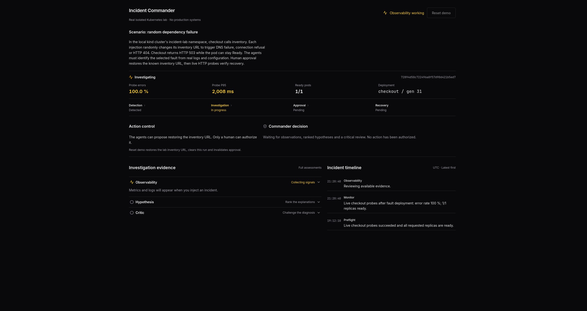
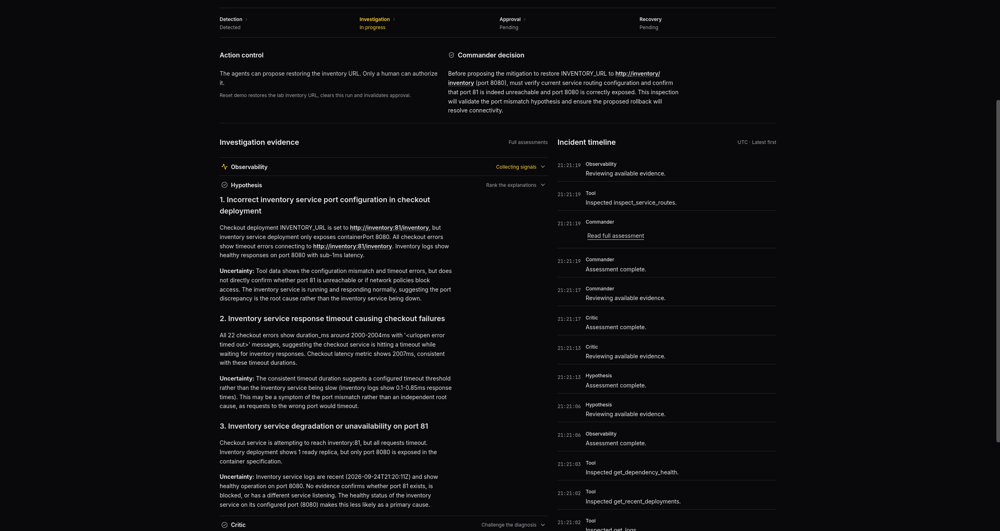
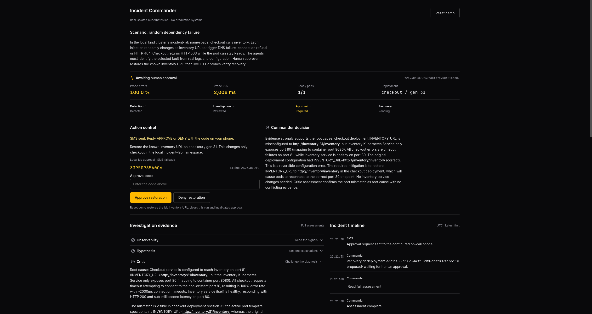
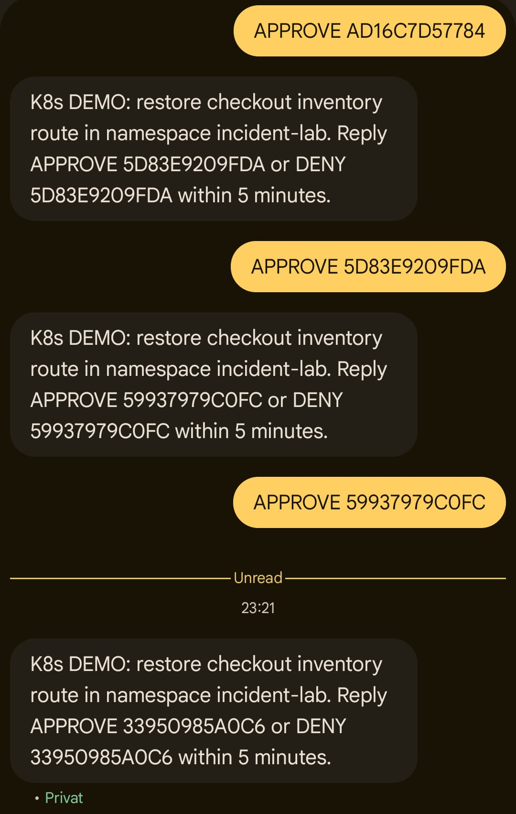
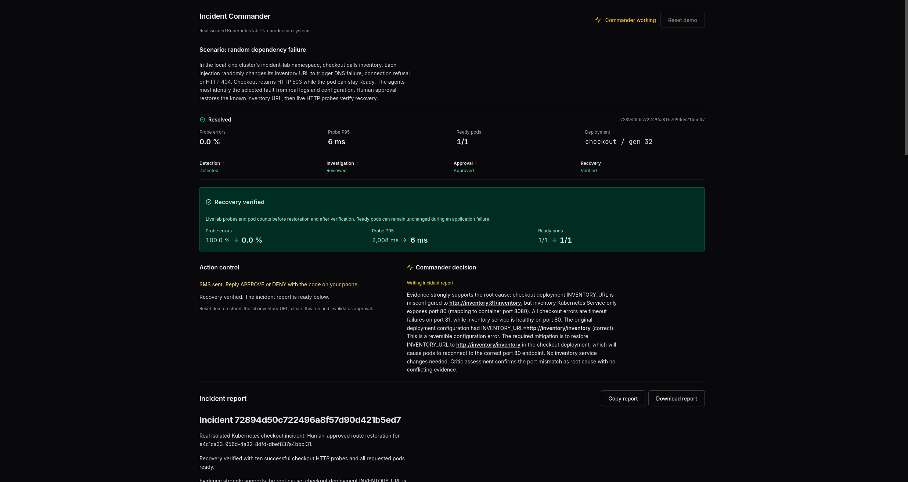

# A real incident, step by step

[← Back to the project](../README.md)

The dashboard screenshots follow one run of the isolated Kubernetes demo on **24 September 2026**. Checkout is configured to call inventory on port `81`, while the inventory Service exposes port `80`. Requests time out and checkout returns HTTP 503, even though its pod stays Ready.

Click a screenshot to inspect it at full resolution. The captures preserve the original UI and the agents' intermediate assessments.

## 1. Detect and investigate

Checkout's probe error rate reaches **100%**. The pod is still **1/1 Ready**, so readiness alone does not reveal the broken dependency. Observability begins collecting live evidence.

## 2. Challenge the explanation

Hypothesis ranks possible causes. The Commander requests service-routing evidence before proposing restoration. The intermediate assessments still contain uncertainty; the final decision distinguishes the Service's port `80` from the container's port `8080`.

## 3. Ask the human

The Commander proposes restoring the known inventory URL. The dashboard shows the rationale, the deployment being changed, SMS status and an explicit local approval fallback. The app waits for approval before restoring the lab.

The approval shown belongs to this completed run and has already been consumed.

### SMS on the phone

The on-call phone receives the proposed action, the lab namespace and exact instructions to approve or deny within five minutes.

  

The **23:21** request matches the approval code in the dashboard above. The visible `APPROVE` replies belong to earlier requests; the reply to this run is not shown in the phone capture.

## 4. Verify the result

After approval, the app restores the inventory URL and verifies recovery using live HTTP probes. The report controls appear below the recovery summary; the Commander is still finishing the report in this capture.

| Reading | Before restoration | After verification |
| --- | --- | --- |
| Probe errors | 100.0% | 0.0% |
| Probe P95 | 2,008 ms | 6 ms |
| Ready pods | 1/1 | 1/1 |
| Checkout deployment generation | 31 | 32 |

These are observations from this one run. The small probe sample is a demo snapshot, not a latency benchmark. Pod readiness remains unchanged while the application recovers.

[Run the demo locally](../README.md#run-it-locally) · [Development and SMS setup](development.md)
